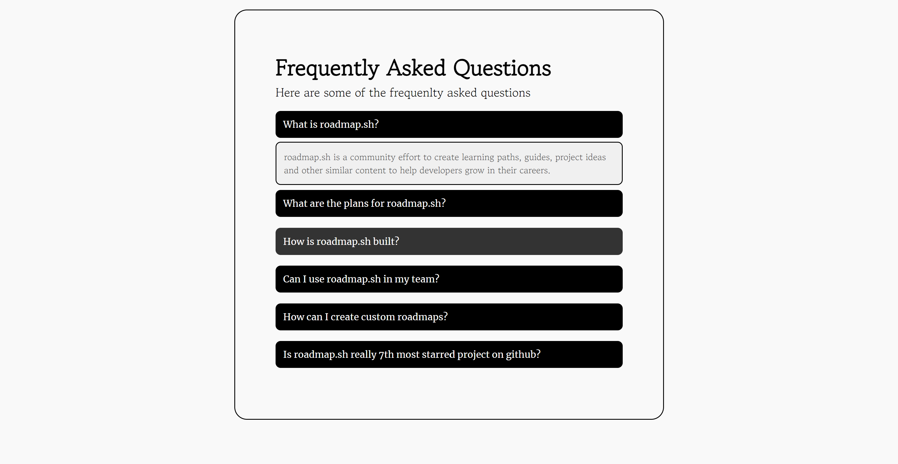

# Accordion Component

This project demonstrates the creation of a dynamic accordion component using **HTML**, **CSS**, and **JavaScript**. The accordion allows users to toggle between questions, displaying one answer at a time. When a new question is clicked, its content expands while collapsing any other open section, ensuring only one is visible.

## Project Description

The goal of this project is to develop a user-friendly accordion that displays frequently asked questions (FAQs) or similar content. Clicking a question reveals its answer while hiding previously expanded sections. For more details about this project, you can check the original description on **[roadmap.sh](https://roadmap.sh/projects/accordion)**.

## Key Features

- **Interactive FAQ Section**: Only one section remains open at a time, providing a clean and simple UI.
- **Smooth Animations**: The accordion sections transition smoothly between states using CSS for better user experience.
- **Customizable Design**: Styled with CSS to allow easy customization of fonts, colors, and overall appearance.
- **Simple and Lightweight**: Implemented using basic HTML, CSS, and vanilla JavaScript without the need for external libraries.

## Screenshot



## Technologies Used

- **HTML**: Markup for structuring the accordion component.
- **CSS**: Handles design, layout, and transitions.
- **JavaScript**: Controls the expand/collapse behavior of the accordion sections.

## Demo

You can check out a working demo of this accordion component here:

- **Live Demo**: [CodePen Demo](https://codepen.io/Yashi-Singh/pen/ExqVKQB)

## Setup Instructions

To get started locally, follow these steps:

1. Clone the repository:
   ```bash
   git clone https://github.com/Yashi-Singh-9/Accordion.git
   ```

2. Navigate to the project directory:
   ```bash
   cd Accordion
   ```

3. Open `index.html` in any browser to view the accordion in action.

## How It Works

- When the page loads, all sections are collapsed by default.
- Clicking on any question expands the corresponding answer and collapses any other open section.
- The transition effects are handled with CSS, while JavaScript ensures only one section remains open.

## Links

- **Project URL on roadmap.sh**: [roadmap.sh Accordion Project](https://roadmap.sh/projects/accordion)
- **Live Demo**: [CodePen Live Example](https://codepen.io/Yashi-Singh/pen/ExqVKQB)

## License

This project is licensed under the [MIT License](LICENSE). Feel free to use, modify, and distribute it as needed.
